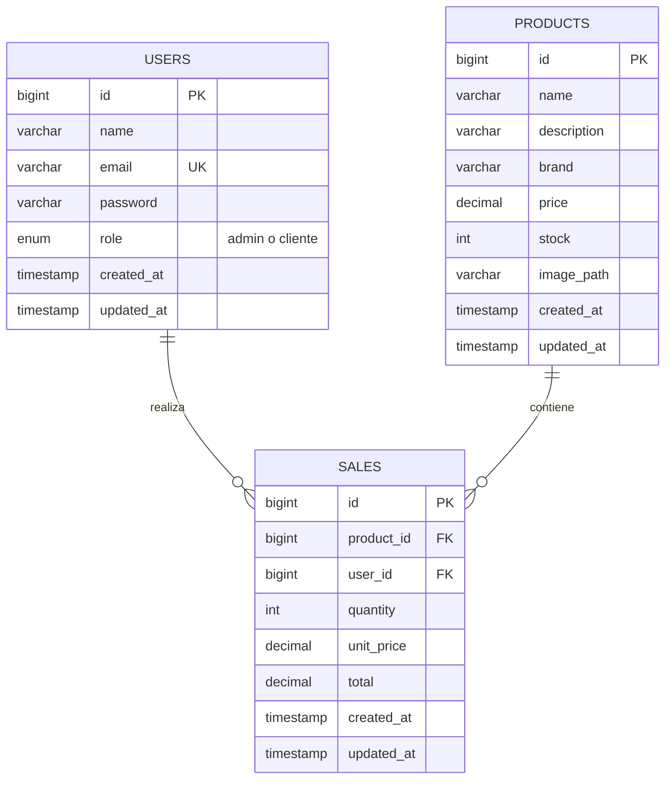

# Diagrama entidad-relación

El sistema utiliza una base de datos relacional con tres entidades principales:

- **users:** guarda administradores y clientes. El campo `role` separa permisos: `admin` puede agregar, editar y eliminar productos; `cliente` puede iniciar sesión y comprar.
- **products:** guarda los productos del punto de venta, su precio, stock e imagen.
- **sales:** guarda cada operación de venta/compra, relacionando el usuario que compró o vendió con el producto.

